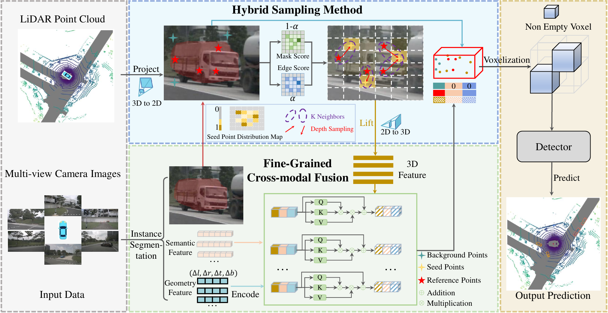
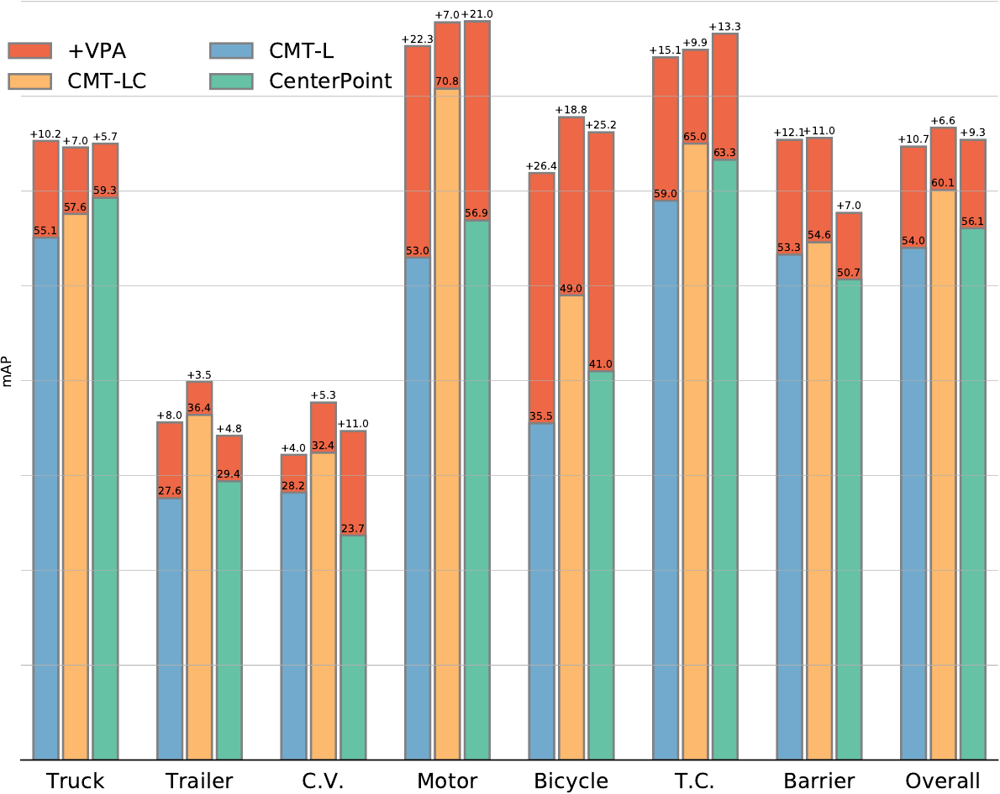

# [TCSVT 2025] VPA: Multi-modal Virtual Point Augmentation for 3D Object Detection

<!-- ## Introduction -->

<div align="center">
  

  <em style="text-align: left; display: block;">The framework of our Virtual Point Augmenting (VPA) involves several steps. Given a LiDAR point cloud and corresponding multi-view camera images, VPA first segments the images and projects raw points into image space. It then employs the proposed hybrid sampling method to generate virtual points. Next, a fine-grained cross-fusion module is used to fuse semantic features (SF) and geometric features (GF) from 2D images, as well as 3D position features from the 3D LiDAR. Finally, these augmented virtual points and raw points are fed into any LiDAR-based or fusion-based 3D detectors to obtain the output prediction. 0 means zero vector.</em>
  
  
<em style="text-align: left; display: block;">Comparison results under different object categories on nuScenes benchmark among our VPA with classical detectors. It shows the promising performance of our method under different types of 3D object detectors with multi-modal input data.</em>

</div><br/>

## Preparation

* Environments  
Python == 3.8 \
CUDA == 11.1 \
pytorch == 1.9.0 \
mmcv-full == 1.6.0 \
mmdet == 2.24.0 \
mmsegmentation == 0.29.1 \
mmdet3d == 1.0.0rc5 \
spconv-cu111 == 2.1.21 \
[flash-attn](https://github.com/HazyResearch/flash-attention) == 0.2.2

* Data   
Follow the [mmdet3d](https://github.com/open-mmlab/mmdetection3d/blob/master/docs/en/data_preparation.md) to process the nuScenes dataset.


## Train & inference
```bash
# train
bash tools/dist_train.sh /path_to_your_config 8
# inference
bash tools/dist_test.sh /path_to_your_config /path_to_your_pth 8 --eval bbox
```
